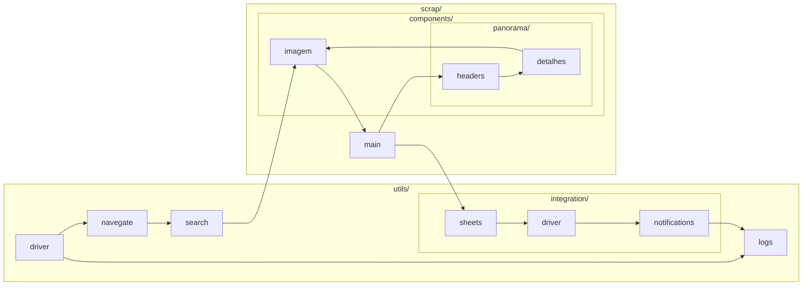
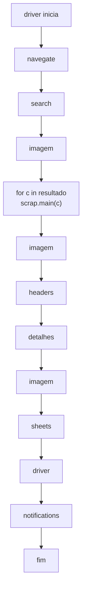

# UML da Solucao

Este documento consolida os diagramas UML da arquitetura proposta para o desafio descrito no `README.md`.

## Diagrama de Componentes

```mermaid
flowchart LR
    subgraph utils["utils/"]
        u_driver["driver"]
        u_navegate["navegate"]
        u_logs["logs"]
        u_search["search"]

        subgraph integration["integration/"]
            i_driver["driver"]
            i_sheets["sheets"]
            i_notifications["notifications"]
        end
    end

    subgraph scrap["scrap/"]
        s_main["main"]

        subgraph components["components/"]
            c_imagem["imagem"]

            subgraph panorama["panorama/"]
                p_headers["headers"]
                p_detalhes["detalhes"]
            end
        end
    end

    u_driver --> u_navegate
    u_driver --> u_logs
    u_navegate --> u_search
    u_search --> c_imagem
    c_imagem --> s_main
    s_main --> p_headers
    p_headers --> p_detalhes
    p_detalhes --> c_imagem
    s_main --> i_sheets
    i_sheets --> i_driver
    i_driver --> i_notifications
    i_notifications --> u_logs
```

## UML de Fluxo

```mermaid
flowchart TD
    start["driver inicia"]
    navegate["navegate"]
    search["search"]
    imagem_inicio["imagem"]
    loop["for c in resultado\nscrap.main(c)"]
    imagem_panorama["imagem"]
    headers["headers"]
    detalhes["detalhes"]
    imagem_fim["imagem"]
    sheets["sheets"]
    driver_integracao["driver"]
    notifications["notifications"]
    end_node["fim"]

    start --> navegate
    navegate --> search
    search --> imagem_inicio
    imagem_inicio --> loop
    loop --> imagem_panorama
    imagem_panorama --> headers
    headers --> detalhes
    detalhes --> imagem_fim
    imagem_fim --> sheets
    sheets --> driver_integracao
    driver_integracao --> notifications
    notifications --> end_node
```
