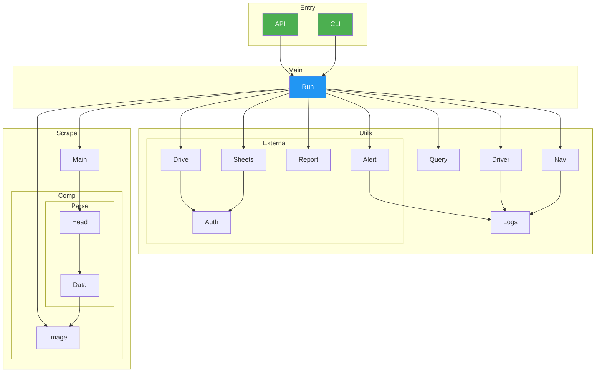

# UML da Solução

Este documento consolida os diagramas UML da arquitetura proposta para o desafio descrito no `README.md`.

## Diagrama de Componentes



## Diagrama de Fluxo de Execução

```mermaid
flowchart TD
    start["🚀 Início"]
    parser["📋 Parse"]
    
    driver_create["🌐 Setup"]
    page_open["📄 Open"]
    search_run["🔍 Find"]
    refine["🎯 Filter"]
    
    check_results{"Has<br/>Data?"}
    
    screenshot["📸 Capture"]
    scrape["🔗 Extract"]
    
    json_save["💾 Store"]
    summary_build["📊 Summary"]
    
    drive_upload["☁️ Upload"]
    sheets_sync["📋 Sync"]
    
    email_send["📧 Notify"]
    
    driver_close["🔌 Stop"]
    
    response["✅ Done"]
    end_node["🏁 End"]
    
    start --> parser
    parser --> driver_create
    driver_create --> page_open
    page_open --> search_run
    search_run --> refine
    refine --> screenshot
    screenshot --> check_results
    
    check_results -->|Sim| scrape
    check_results -->|Não| json_save
    
    scrape --> json_save
    json_save --> summary_build
    summary_build --> drive_upload
    drive_upload --> sheets_sync
    sheets_sync --> email_send
    email_send --> driver_close
    driver_close --> response
    response --> end_node
    
    style start fill:#4CAF50,color:#fff
    style response fill:#4CAF50,color:#fff
    style end_node fill:#4CAF50,color:#fff
    style check_results fill:#FF9800,color:#fff
```



## Descrição dos Módulos

### 📂 Entry Points

| Módulo | Função | Tecnologia |
| :---- | :---- | :---- |
| **api.py** | Expõe a automação como API REST com documentação Swagger | FastAPI |
| **main.py** | Interface CLI para execução local da automação | argparse |

### 📂 Orquestração (main.py)

| Função | Responsabilidade |
| :---- | :---- |
| **_run_execution()** | Orquestrador principal que coordena todo o fluxo |
| **build_parser()** | Constrói argumentos CLI |
| **_create_execution_dir()** | Cria diretório com timestamp para artefatos |
| **_has_results()** | Verifica se há resultados na busca |
| **execute()** | Wrapper CLI para _run_execution() |

### 📂 utils/ - Utilitários

| Módulo | Responsabilidade |
| :---- | :---- |
| **driver.py** | Gerencia criação e configuração do Selenium WebDriver |
| **navegate.py** | Navegação no Portal da Transparência |
| **search.py** | Executa buscas e filtra resultados |
| **logs.py** | Configuração centralizada de logging |

### 📂 utils/integration/ - Integrações Externas

| Módulo | Responsabilidade |
| :---- | :---- |
| **google.py** | Client base para APIs do Google (OAuth2) |
| **drive.py** | Upload de artefatos para Google Drive |
| **sheets.py** | Sincronização de dados para Google Sheets |
| **summary.py** | Construção do sumário de execução |
| **notification.py** | Envio de notificações por email |
| **driver.py** | Configuração de credenciais e contexto de integração |

### 📂 scrap/ - Web Scraping

| Módulo | Responsabilidade |
| :---- | :---- |
| **main.py** | Orquestrador de scraping dos resultados |
| **components/imagem.py** | Captura e conversão de screenshots para Base64 |
| **components/panorama/headers.py** | Extrai cabeçalhos de benefícios |
| **components/panorama/detalhes.py** | Extrai detalhes de cada benefício |

## Fluxo de Dados

```
Entrada (API/CLI)
    ↓
┌─────────────────────────────────────┐
│  1. Navegação & Busca               │
│     - Abrir página                  │
│     - Executar busca                │
│     - Capturar screenshot           │
└─────────────────────────────────────┘
    ↓
┌─────────────────────────────────────┐
│  2. Scraping de Resultados          │
│     - Extrair dados de panorama     │
│     - Extrair detalhes de benefícios│
└─────────────────────────────────────┘
    ↓
┌─────────────────────────────────────┐
│  3. Persistência Local              │
│     - Salvar JSON com dados         │
│     - Salvar imagem PNG             │
└─────────────────────────────────────┘
    ↓
┌─────────────────────────────────────┐
│  4. Integrações Externas            │
│     - Upload Google Drive           │
│     - Sincronizar Google Sheets     │
│     - Enviar email                  │
└─────────────────────────────────────┘
    ↓
Saída (ExecutionResponse)
```

## Tecnologias Utilizadas

| Categoria | Tecnologia | Uso |
| :---- | :---- | :---- |
| **Web Driver** | Selenium | Automação do browser |
| **Web Framework** | FastAPI | API REST |
| **Web Scraping** | BeautifulSoup / CSS Selectors | Extração de dados |
| **Google Integração** | google-auth, google-api-client | OAuth2, Drive, Sheets |
| **Email** | SMTP | Notificações |
| **Logging** | Python logging | Auditoria e debugging |
| **Async** | asyncio (preparado) | Execuções paralelas |
